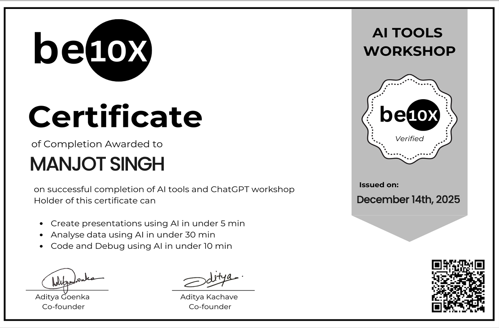

# Manjot Singh – Portfolio

Welcome to my personal portfolio website!  
This site showcases my projects and skills in **Robotics, AI and Web Development**.

## 🔗 Live Website
👉 https://1588manjotsingh7b.github.io

## 📌 About Me
I am a tech enthusiast who loves robotics, coding and building AI-based projects.  
I enjoy learning new technologies and working on practical projects.

## My Certification 
- I got Certified by India's best Tutors From BE10X
  
  
## 🚀 Skills
- Robotics
- Arduino & NodeMCU
- Web Development (HTML, CSS, JavaScript)
- AI / Machine Learning (beginner)
- IoT Projects

## 🧩 Projects Included
- Olympic Data Anyaliser
- Personalised Movies Recommandator System
*(Projects will keep updating)*

## 📬 Contact
📧 Email: 1588manjotsingh7b@gmail.com
🐙 GitHub: https://github.com/1588manjotsingh7b
